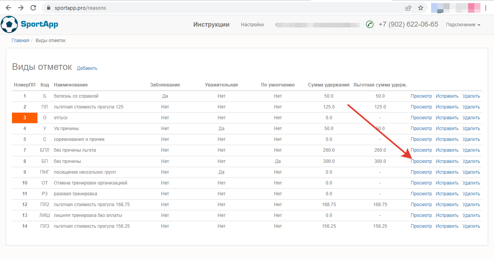
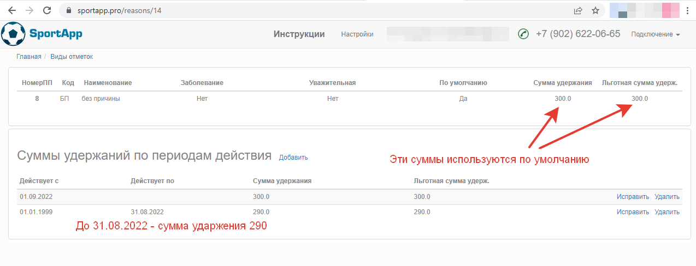

## Суммы удержаний по периодам действия

Суммы удержаний могут быть отличаться в разные периоды времени. Например, требуется повысить цены в какие-то даты. Для этого нужно зайти в справочник **Виды отметок**, выбрать отметку, нажать на **Просмотр**, далее в спецификации укзать суммы и даты действия.

Главная => Виды отметок => Просмотр

